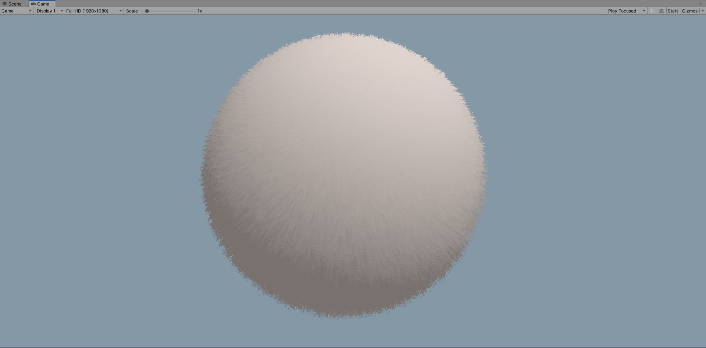

# Shell Texturing

by Acerola

A fully annotated beginner graphics programming project for Unity (built-in rendering pipeline) intended to help those with little shader knowledge to grasp the basics.

## Example

